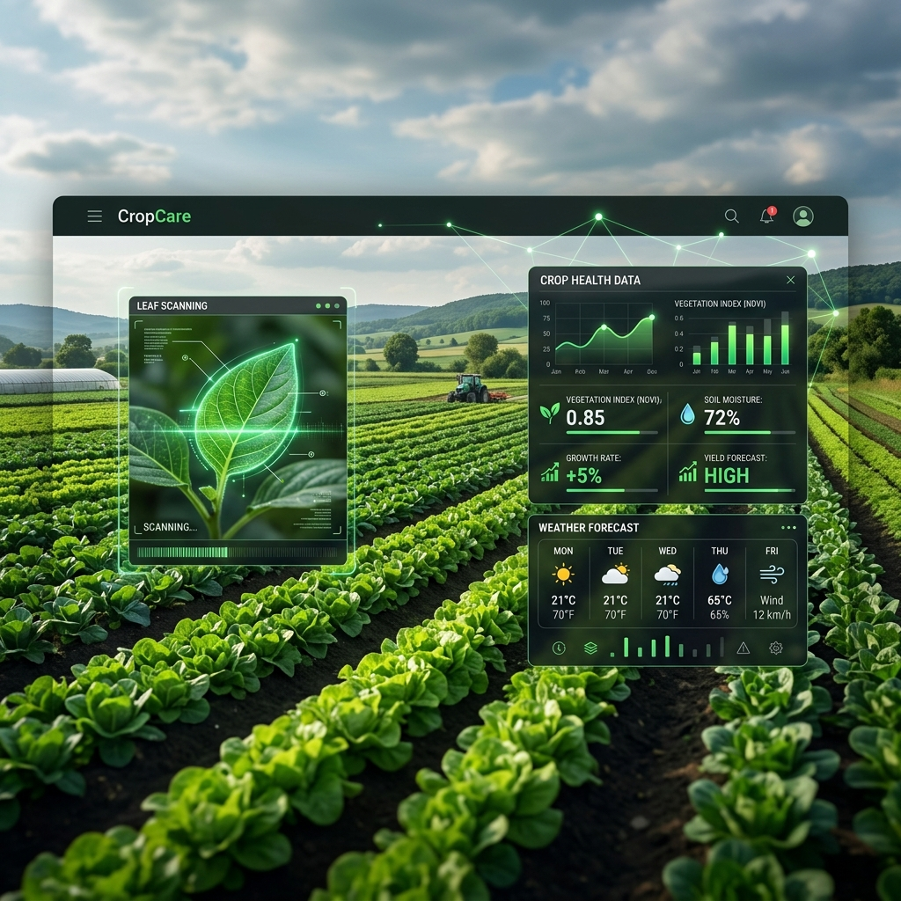

# 🌱 CropCare AI



**CropCare AI** is a state-of-the-art, AI-powered agricultural ecosystem designed to empower farmers with precision farming tools. Built as a high-performance Progressive Web App (PWA) with native Android/iOS support via Capacitor, CropCare provides real-time insights, disease diagnosis, and community connectivity even in low-bandwidth or offline environments.

---

## 🚀 Key Features

### 🔍 AI Disease Detection
- **Instant Diagnosis**: Capture photos of infected leaves and get immediate AI-powered diagnosis of pests and diseases.
- **Expert Recommendations**: Receive tailored treatment plans and organic/chemical solutions based on the diagnosis.

### 🌤️ Intelligence Hub
- **Precision Weather**: Hyper-local weather forecasting with specialized agricultural alerts (frost, humidity, pest risk).
- **Yield Forecasting**: Data-driven insights to predict harvest outcomes based on current farm conditions.
- **Fertilizer Calculator**: Optimize input usage with precision calculators for various crop types.

### 👥 Farmer Network
- **Community Feed**: Connect with fellow farmers and agricultural experts to share experiences and seek advice.
- **Knowledge Sharing**: Access a library of best practices for sustainable and high-yield farming.

### 🗣️ Multilingual Voice Assistant
- **Local Languages**: Voice assistance available in **English, Hindi, and Bengali** to ensure accessibility for all farmers.
- **Hands-Free Operation**: Get advice on weather, fertilizers, and diseases without needing to type.

### 📶 Offline-First Architecture
- **PWA Ready**: Installable on any device with full offline capabilities for critical features.
- **Low-Bandwidth Optimization**: Designed to function smoothly in rural areas with spotty internet connectivity.

### 📱 Native Mobile Integration
- **Haptic Feedback**: Tactile responses for a more intuitive user experience.
- **Push Notifications**: Stay updated with real-time alerts for weather changes and community interactions.
- **Camera Bridge**: Deep integration with native device cameras for high-quality diagnostic scanning.

---

## 🛠️ Tech Stack

- **Framework**: [Next.js 15](https://nextjs.org/) (React 19)
- **Language**: [TypeScript](https://www.typescriptlang.org/)
- **Styling**: [Tailwind CSS](https://tailwindcss.com/)
- **Animations**: [Framer Motion](https://www.framer.com/motion/)
- **Mobile Bridge**: [Capacitor](https://capacitorjs.com/)
- **PWA**: [next-pwa](https://github.com/ducanh2912/next-pwa)
- **Backend/Realtime**: [Firebase](https://firebase.google.com/)
- **Icons**: [Lucide React](https://lucide.dev/)

---

## 🏁 Getting Started

### Prerequisites
- Node.js (Latest LTS)
- npm or yarn

### Installation

1. Clone the repository:
   ```bash
   git clone https://github.com/yourusername/cropcare.git
   cd cropcare
   ```

2. Install dependencies:
   ```bash
   npm install
   ```

3. Configure Environment Variables:
   Create a `.env.local` file in the root and add your Firebase and API configurations:
   ```env
   NEXT_PUBLIC_FIREBASE_API_KEY=your_key
   NEXT_PUBLIC_WEATHER_API_KEY=your_key
   ```

### Development

Run the development server:
```bash
npm run dev
```
Open [http://localhost:3000](http://localhost:3000) to see the result.

---

## 📱 Mobile Deployment

CropCare uses **Capacitor** to deliver a native mobile experience.

### Build and Sync

1. Create a production build:
   ```bash
   npm run build
   ```

2. Sync with native platforms:
   ```bash
   npx cap sync
   ```

3. Open in Android Studio:
   ```bash
   npx cap open android
   ```

---

## 📂 Project Structure

```
cropcare/
├── android/              # Native Android project files
├── public/               # Static assets & PWA icons
├── src/
│   ├── app/              # Next.js App Router (Pages & Layouts)
│   ├── components/       # UI Components (Feature-based)
│   │   ├── DiseaseDetection/
│   │   ├── Weather/
│   │   ├── Community/
│   │   └── ...
│   ├── hooks/            # Custom React hooks
│   ├── lib/              # Utilities & Native Bridges
│   └── ...
├── capacitor.config.ts   # Mobile configuration
├── next.config.ts        # Next.js & PWA configuration
└── tailwind.config.ts    # Design system configuration
```

---

## 📄 License

This project is licensed under the MIT License - see the [LICENSE](LICENSE) file for details.

---

Built with ❤️ for the farming community.
